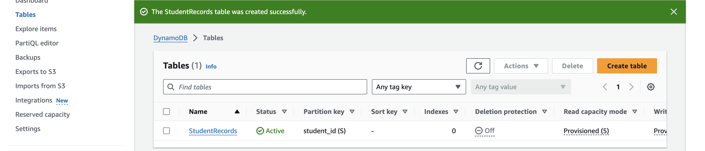
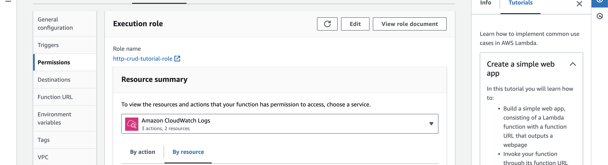
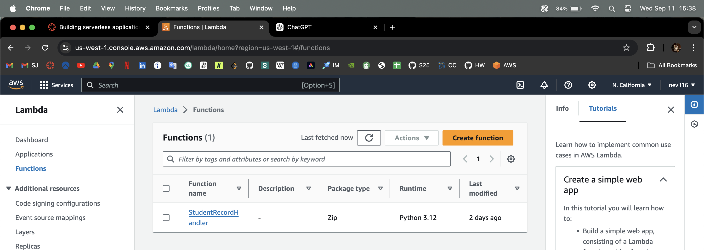
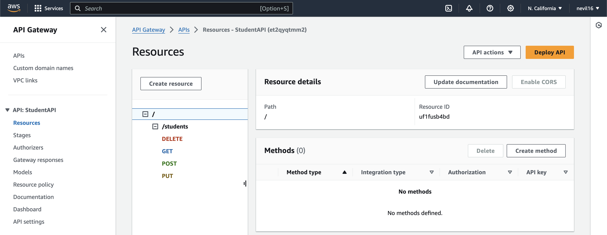
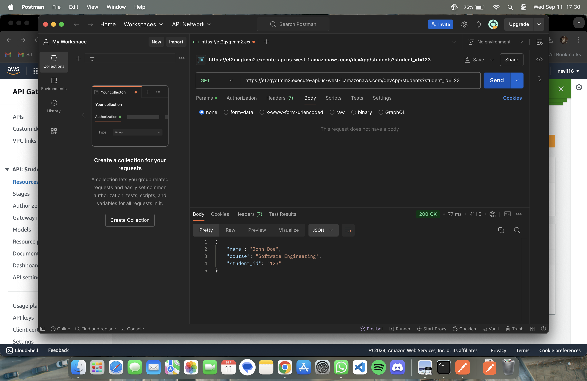
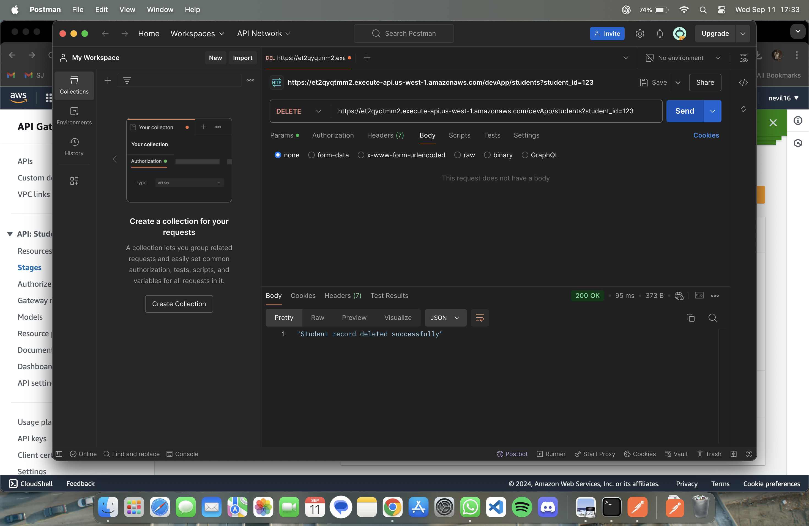
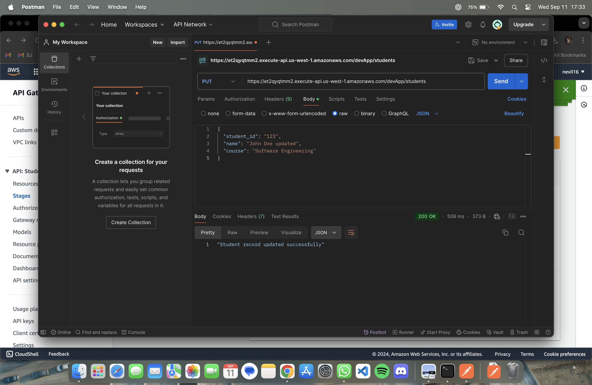

CMPE272 Assignment 2 (Serverless Apptication)
=======
# Author : Nevil Padariya
## SJSU ID : 017555369

* This project utilizes the Amazon Web Services to build serverless application which perform the CRUD operations on DynamoDB

## Technologies Used in this Application
> 1. Amazon Web Services
> 2. Lambda Function (in Python)
> 3. AWS Dynamodb

## Steps

### Step 1 : Setting up Database using AWS Dynamodb
> 1. Go to AWS management console and open Dynamodb and Create a table named "StudentRecords".
> 2. Mention the primary key as "student_id" and it should be string.
> 

### Step 2 : Setting up IAM role
> 1. Go to Identity Access Management and Create a user role which has full access to DynamoDB
> 


### Step 3 : Setting up Lambda Function
> 1. Go to AWS Lambda console and create a new function and give a name StudentRecordHandler
> 2. Chose appropriate runtime, in this project, I am going to utilize Python 3.9 Runtime
> 
> 3. Copy and Paste code written in lambda.py to lambda function
> 4. Click on Deploy


### Step 4: Create an API Gateway
> 1. Go to AWS API Gateway control and click on Build for REST API.
>   

> 1. create POST API Method in /students Resource
>   
> 2. create GET API Method in /students Resource
>   
> 3. create PUT API Method in /students Resource
>   
> 4. create DELETE API Method in /students Resource
>   

### Results
>    1. test_post event
>       * Paste the following JSON to test configuration window
>         * ```{"method": "POST", "body": "{"student_id": "123", "name": "John Doe", "course": "Enterprise Software"}"}```
>       * Result
>       
>    2. test_get event
>       * Paste the following JSON to test configuration window
>         *  ``` { "method": "GET", "query": { "student_id": "123"}} ```
>       * Result
>       
>    3. test_delete event
>       * Paste the following JSON to test configuration window
>         *  ``` {"method": "DELETE", "query": {"student_id": "123"}} ```
>       * Result
>       
>    4. test_update event
>       * Paste the following JSON to test configuration window
>         *  ``` {"method": "PUT", "body": "{"student_id": "123", "name": "John Doe updated", "course": "Enterprise Software"}"} ```
>       * Result
>       


* Currently, this application supports both READ and WRITE operations on DynamoDB via a Lambda function through a REST API.

## Issues Faced
* During the development of this project, I encountered an issue with integrating a REST API with a Lambda function, specifically in parsing the request body in the Lambda function. To resolve this, I created a custom mapping template capable of handling both GET and POST requests.